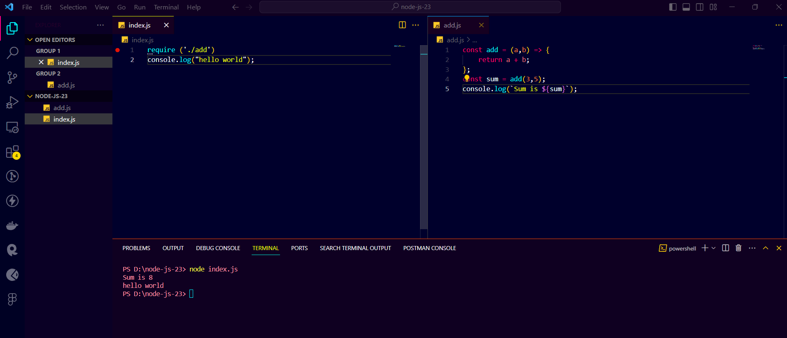

# Local Modules

### Common JS&#x20;

CommonJS is a standard that states how a module should be structured and shared

Node.JS adopted CommonJS when it Started out and is what you will see in code bases

### Local Modules

1. In Node.js, each file is a module that is isolated by default
2. To load a module into another file, we use the require function
3. When Index.js is Executed, the code in the module is also executed
4. If the file we are requiring is a javascript file, we can skip specifying the extension and node.js will infer it on our behalf

Example

```javascript
require ('./file-name')
```

<figure><figcaption></figcaption></figure>

